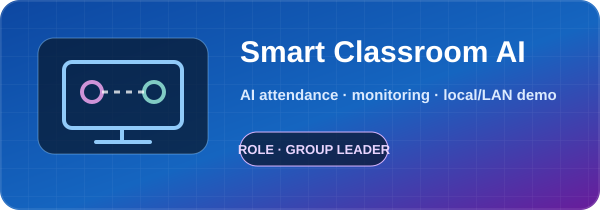
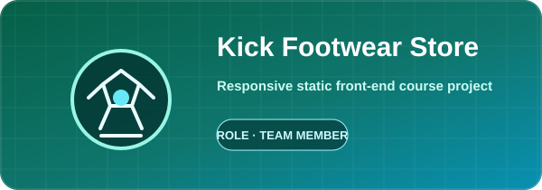

## About Me

I am a **Computer Science student at the Royal University of Phnom Penh and a software developer** with a growing focus on **web and backend development**.

I learn by building practical projects, working with teams, and improving academic work into clearer portfolio evidence. My long-term direction is **Software Engineering**, with an emphasis on maintainable systems, testing, architecture, and reliable delivery.

> **Open to full-time, internship, freelance software development opportunities, and meaningful collaboration.**

---

## Current Focus

<table>
<tr>
<td width="33%" valign="top">

### 🌐 Web Development

Responsive interfaces, structured pages, JavaScript interaction, and modern front-end workflows.

</td>
<td width="33%" valign="top">

### ⚙️ Backend & Data

APIs, server-side logic, relational data, validation, and practical database-backed applications.

</td>
<td width="33%" valign="top">

### 🧭 Engineering Direction

Software design, testing, documentation, deployment, teamwork, and maintainable development practices.

</td>
</tr>
</table>

---

## Core Technologies

### Technologies I use in projects and coursework

**Database focus:** PostgreSQL  
**Relational database experience:** PostgreSQL · Microsoft SQL Server · SQLite  
**Currently learning:** Docker · MongoDB

<strong>Additional coursework and project exposure</strong>

 

C · C++ · PHP · Laravel basics · OpenCV · Raspberry Pi · SQLAlchemy

---

## Selected Projects

<table>
<tr>
<td width="33%" valign="top">

### Smart Classroom AI

**Role:** Group Leader  
**Context:** Academic group project · MVP / final demo

Teacher-focused attendance and monitoring system using face recognition, QR attendance backup, reports, object detection, and local/LAN demonstration workflows.

**Stack:** Python · FastAPI · SQLite · SQLAlchemy · OpenCV · YOLO · Raspberry Pi

[Repository →](https://github.com/TunSopheak/Smart-Classroom-AI-IoT)

</td>
<td width="33%" valign="top">

### PhsarKhmer Web App

**Role:** Team Member  
**Context:** Web Design course team project

Responsive Cambodian e-commerce interface with product, category, brand, promotion, search, authentication, cart, payment, and seller UI prototypes.

**Stack:** HTML · CSS · Tailwind CSS · JavaScript · GitHub Pages · Vercel

[Repository →](https://github.com/TunSopheak/PhsarKhmer-WebApp) · [Live demo →](https://phsar-khmer-web.vercel.app/)

</td>
<td width="33%" valign="top">

### Kick Footwear Store

**Role:** Team Member  
**Context:** Web Design course mini project

Responsive multi-page football footwear store covering collections, brands, players, product details, favorites, cart, sign-in, contact, and informational pages.

**Stack:** HTML · Tailwind CSS · Font Awesome · Responsive Web Design · Vercel

[Repository →](https://github.com/TunSopheak/Kick) · [Live demo →](https://kick-footwear-store.vercel.app)

</td>
</tr>
</table>

---

## Education & Direction

<table>
<tr>
<td width="50%" valign="top">

### 🎓 Education

**Royal University of Phnom Penh**  
Computer Science student

</td>
<td width="50%" valign="top">

### 🚀 Career Direction

**Current identity:** Software Developer  
**Current focus:** Web & Backend Development  
**Long-term direction:** Software Engineering

</td>
</tr>
</table>

---

## GitHub Activity

Scheduled to check public GitHub activity every six hours. The dashboard displays the latest successful refresh date, not a live clock.

---

### Build practical software · Learn continuously · Improve responsibly

**Thank you for visiting my profile.**

