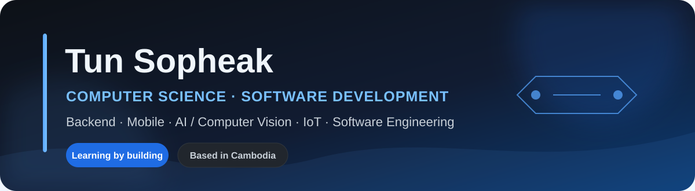

### Computer Science Student · Software Developer · Project Builder

`Cambodia` · `Royal University of Phnom Penh` · `Open to internships and collaboration`

---

## About Me

I am a **fourth-year Computer Science student at the Royal University of Phnom Penh (RUPP)**. I learn by building practical software projects and improving them into clear, tested, and portfolio-ready work.

- **Core interests:** Backend Development, Mobile Development, Software Engineering, AI/Computer Vision, and IoT
- **Working style:** Requirements first, structured implementation, testing, documentation, and continuous improvement
- **Career direction:** Software Developer / Backend Developer / Mobile Developer internship and junior opportunities

> I aim to build technology that is useful, responsible, understandable, and grounded in real problems.

---

## Technology Stack

### Programming Languages

  

### Web · Backend · Mobile

  

### Databases · AI · IoT · Tools

  

<strong>Detailed skills</strong>

 

- **Programming:** Python, Java, C, C++, C#, Dart, JavaScript, PHP
- **Web & Backend:** HTML, CSS, Tailwind CSS, React basics, FastAPI, Jinja2, Laravel basics, REST APIs
- **Mobile & Design:** Flutter, Dart, Figma, Android Studio
- **Databases:** MySQL, PostgreSQL, SQLite, SQL Server, SQL, ERD, database design
- **AI & IoT:** OpenCV, face recognition, object detection, Raspberry Pi, Arduino, ESP32/ESP8266, sensors
- **Engineering Tools:** Git, GitHub, VS Code, NetBeans, Postman, Linux basics, Windows PowerShell
- **Analysis:** Requirements analysis, DFD, flowcharts, UML basics, system documentation

---

## Featured Projects

<table>
<tr>
<td width="33%" valign="top">

### 🏫 Smart Classroom AI

Teacher-focused attendance and monitoring MVP with face recognition, QR backup, reports, and LAN demonstration workflows.

**Stack**  
Python · FastAPI · SQLite · SQLAlchemy · OpenCV · YOLO · Raspberry Pi

**Status:** `MVP / Final Demo`

[View repository →](https://github.com/TunSopheak/Smart-Classroom-AI-IoT)

</td>
<td width="33%" valign="top">

### 🌐 VitouLens AI

Experimental Chrome extension and local backend for English-to-Khmer technical-content translation with terminology and structure protection.

**Stack**  
JavaScript · Chrome MV3 · Python · FastAPI · NLLB · Gemini

**Status:** `Paused / Portfolio Prototype`

[View repository →](https://github.com/TunSopheak/vitoulens-ai)

</td>
<td width="33%" valign="top">

### 🛍️ PhsarKhmer Web App

Responsive Cambodian e-commerce UI portfolio refresh with deployment, local fallback content, and documented project evidence.

**Stack**  
HTML · CSS · Tailwind CSS · JavaScript · GitHub Pages · Vercel

**Status:** `Deployed Portfolio Project`

[View repository →](https://github.com/TunSopheak/PhsarKhmer-WebApp)

</td>
</tr>
<tr>
<td width="33%" valign="top">

### 👟 Kick

Web design course mini project focused on a modern sports e-commerce interface with collection browsing, product detail pages, favorites, cart, and brand-focused UI.

**Stack**  
HTML · CSS · JavaScript · Responsive UI · Vercel

**Status:** `Portfolio Repository in Progress`

[View repository →](https://github.com/TunSopheak/Kick)

</td>
<td width="33%" valign="top">

### 📄 CurateCV Pro

Resume builder prototype focused on generating a clean, ATS-friendly professional resume/CV workflow and portfolio-oriented export direction.

**Stack**  
TypeScript · Resume UX · DOCX Export · Product Prototype

**Status:** `Paused / Portfolio Prototype`

[View repository →](https://github.com/TunSopheak/curatecv-pro)

</td>
<td width="33%" valign="top">

### 📚 Learning Repositories

Supporting repositories that reflect continuous practice in algorithms, databases, architecture, and roadmap-based learning.

- [Data Structure and Algorithm](https://github.com/TunSopheak/Data-Structure-and-Algorithm)
- [Database SQL](https://github.com/TunSopheak/Database-SQL)
- [Computer Architecture](https://github.com/TunSopheak/Computer-Architecture)
- [My Roadmap](https://github.com/TunSopheak/my-roadmap)

</td>
</tr>
</table>

---

## Live GitHub Analytics

The dashboard is generated **inside this repository with GitHub Actions**. It tracks qualifying public GitHub contributions, summarizes the latest 26 weeks as a line chart, and refreshes automatically each day. GitHub may take up to 24 hours to credit a new qualifying contribution.

---

## Current Growth Areas

| Area | Current direction |
|---|---|
| **Backend Engineering** | APIs, architecture, validation, testing, security, and maintainable services |
| **Mobile Development** | Dart, Flutter, responsive interfaces, state, APIs, and databases |
| **Software Engineering** | Requirements, UX flows, system design, documentation, teamwork, and delivery |
| **AI & Computer Vision** | Responsible practical prototypes using OpenCV and object detection |
| **Professional Development** | English communication, portfolio quality, GitHub workflow, and collaboration |

---

## Professional Values

`Learn continuously` · `Build responsibly` · `Document clearly` · `Test carefully` · `Improve consistently`

### Thank you for visiting.

**Build · Learn · Improve · Repeat**

