  

---

---

## About Me

> **CS Student @ RUPP · Backend Developer · Java, Spring Boot, Python · Open to work**

I'm a **Computer Science student at RUPP** and a **backend-focused developer** passionate about building scalable systems, clean APIs, and reliable software.

My long-term direction is **Software Engineering**, focusing on maintainable systems, architecture, testing, and delivery.

---

## Current Focus

<table>
  <tr>
    <td width="33%" valign="top">

### Backend
APIs, server-side logic, and data-driven applications with **Java · Spring Boot · Python**

</td>
    <td width="33%" valign="top">

### Database
Schema design and query optimization with **PostgreSQL · SQL Server · SQLite**

</td>
    <td width="33%" valign="top">

### Engineering
System architecture, testing, documentation, and maintainable code

</td>
  </tr>
</table>

---

## Core Technologies

**Backend & Languages**

**Database & Tools**

**Frontend (Supporting)**

<strong>Additional Exposure</strong>

C · C++ · PHP · Laravel basics · OpenCV · Raspberry Pi · SQLAlchemy

---

## Education & Direction

<table>
  <tr>
    <td width="50%" valign="top">

### Education

**Royal University of Phnom Penh (RUPP)**  
Bachelor of Science in Computer Science  
*2023 – 2027*

**GPA:** 3.70 / 4.00

**Relevant Coursework:**
- Data Structures & Algorithms
- Database Systems
- Web Development
- Software Engineering
- Networking
- Operating Systems

</td>
    <td width="50%" valign="top">

### Career Direction

**Current Identity:** Backend Developer  
**Primary Stack:** Java, Spring Boot, Python, PostgreSQL  
**Current Focus:** Web & Backend Development  
**Long-term Direction:** Software Engineering

**Career Goals:**
- Build scalable, maintainable backend systems
- Contribute to meaningful software projects
- Grow into a full-stack or backend engineering role

</td>
  </tr>
</table>

---

## GitHub Activity

*Updated automatically every 6 hours via GitHub Actions.*

---

**Build practical software · Learn continuously · Improve responsibly**

Thank you for visiting my profile.

